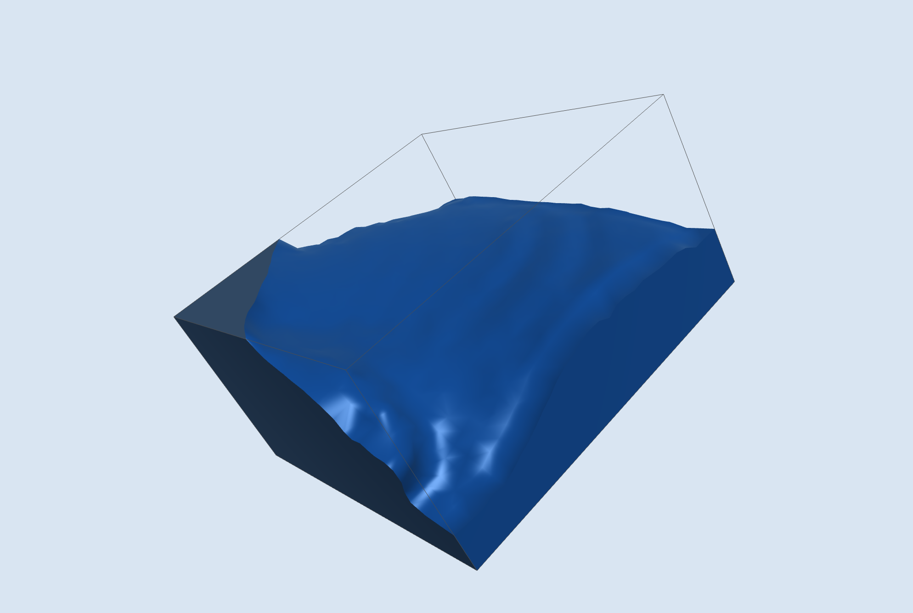

# Sloshing-3D

Real-time interactive 3D sloshing tank simulation using CLSVOF (Coupled Level Set / Volume of Fluid) on a MAC staggered grid, rendered with marching cubes and OpenGL 4.1.

 



## Features

- **CLSVOF interface tracking** — level set for geometry, VOF for conservation, coupled each timestep
- **MAC staggered grid** with PCG pressure solver and MIC(0) preconditioning
- **Semi-Lagrangian advection** (RK2) for velocity and level set
- **TVD Superbee VOF transport** — conservative flux-form with directional splitting
- **Marching cubes rendering** with Phong + Fresnel shading, MSAA, and wall caps
- **Persistent thread pool** — parallel grid operations with no per-frame allocation
- **Mouse-driven interaction** — drag to shake, Option+drag to tilt, scroll to zoom
- **Physics-validated** — standing wave frequency, amplitude retention, volume conservation

## Building

Requires CMake 3.20+ and a C++20 compiler. All other dependencies (GLFW, GLM, glad, GoogleTest) are fetched automatically.

```bash
cmake -S . -B build -DCMAKE_BUILD_TYPE=Release
cmake --build build
```

## Running

```bash
./build/sloshing3d              # Default 32x16x32 grid
./build/sloshing3d 48 24 48    # Custom resolution
```

### Controls

| Input | Action |
|-------|--------|
| Drag | Shake the tank |
| Option+drag | Tilt the tank (rotates gravity) |
| Scroll | Zoom |
| R | Reset simulation |
| F | Reset camera and tilt |
| Esc | Quit |

## Tests

```bash
cmake --build build --target sloshing_tests
ctest --test-dir build
```

28 tests covering PLIC geometry, VOF conservation, level set reinitialization, CLSVOF coupling, pressure solver correctness, and physics validation:

- **1.1% frequency error** vs analytical shallow-water theory
- **67.5% amplitude retention** over 4 wave periods
- **Volume conservation** to machine precision (~10^-12 relative error)

## Documentation

```bash
doxygen Doxyfile
open docs/html/index.html
```

## Project Structure

```
include/sloshing/
  grid.h               MAC staggered grid, Array3D, cell classification
  simulation.h         Timestep driver, adaptive CFL, body forces
  pressure_solver.h    PCG + MIC(0) Poisson solver
  advection.h          Semi-Lagrangian advection, TVD VOF, PLIC geometry
  clsvof.h             Level set / VOF coupling, reinitialization
  renderer.h           OpenGL rendering, marching cubes, camera
  parallel.h           Thread pool, parallel_for, parallel_reduce
  fluid_utils.h        Ghost fluid theta, smooth Heaviside, WENO5
src/
  *.cpp                Implementations (~4200 lines total)
tests/
  test_*.cpp           28 unit and physics validation tests
```

## License

Free for personal, academic, and research use. No warranty. Commercial use requires written permission from the author.
